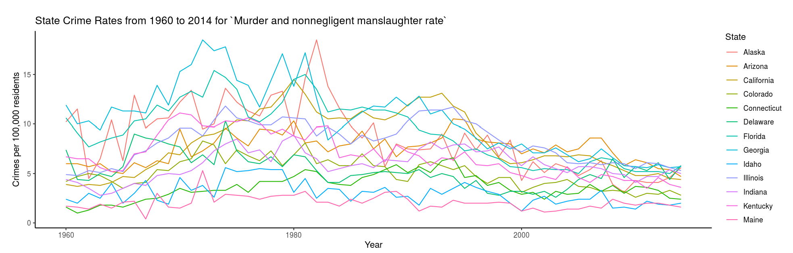

# Crime Data Visualization

_Authors: Andrew Bridglall, Meghan Buonanno, Lindsey Clark, Katherine McDonald_

## Description

This application allows the user to explore the rates of different types of crime in the United States across different states and regions over time. The data for this application is sourced from the [FBI’s Uniform Crime Reporting Survey](https://www.ucrdatatool.gov/). It is important to note that in our analysis, the variable Rape Rate refers to “legacy rape,” which tallies the number of cases of rape in the United States given the original definition of rape, instead of “revised rape” which tallies the number of rape cases from 2013 onwards, given the updated definition of rape. This decision was made in order to keep the data consistent over time.

## App Instructions

This application allows users to visualize both time series plots and bubble plots for different crime rates and years. To create a time series plot, first choose between total US data, state data, and region data. Then select a range of years to analyze and the crime rate of interest. To create a bubble plot with faceting, click on US data, then select the Bubble graph option. Next, select two crime rates and the years of interest for side-by-side comparison.
